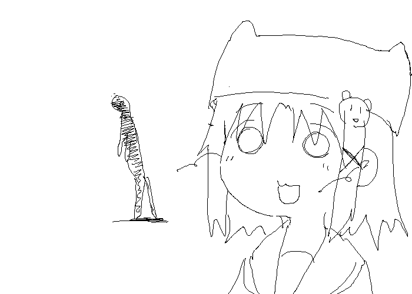

<p align="center">
  <a href="#">
    
  </a>
</p>

Contact me via <code>contact [аt] ynf [dоt] sh</code>. Please include a funny cat picture to prove you are a real person!

---

<details>
<summary>Compile my avatar from the <a href="https://www.tumblr.com/metyashiko/630785783923671040">original artwork</a> into <code>output.{webp,gif,png}</code>:</summary>

```sh
nix run nixpkgs#imagemagick -- \
  "https://64.media.tumblr.com/9a7ff047d8b53d6f722c635a175d744d/tumblr_nrirocSPi71sdbgk2o1_1280.gif" \
  -coalesce \
  -background White -gravity SouthWest -extent "%[fx:w+200]x%[fx:h+200]" \
  -morphology Erode "2x2:1,1 1,1" \
  -fill White \
  -draw "rectangle 265,556 339,590" \
  -draw "rectangle 388,346 389,347" \
  -crop 500x500+265+25 +repage \
  -scale 200% \
  \( -clone 6 -write output.png +delete \) \
  -layers Optimize -write output.webp output.gif
```
</details>